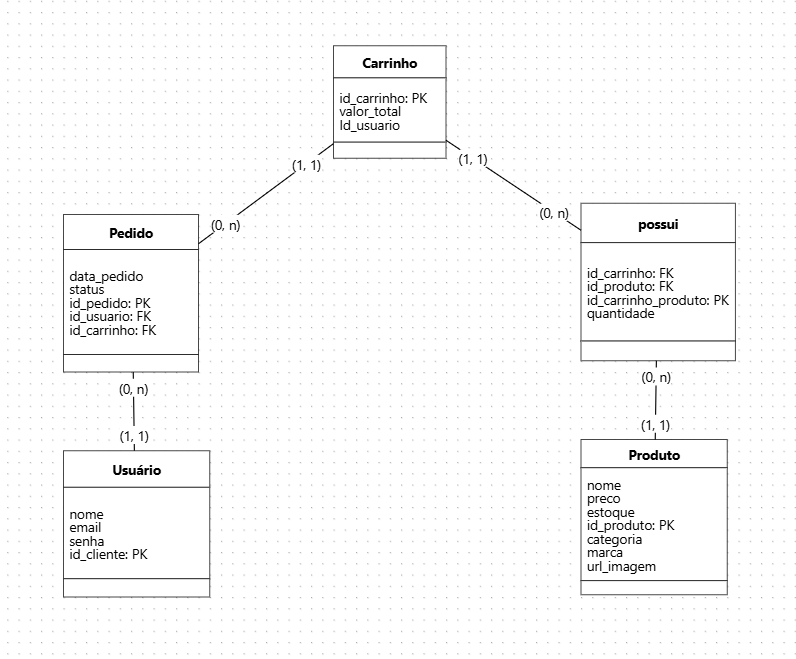

# Documentação - ByteStore

## 📌Índice:

- ✓ [Introdução](#introdução)
- [✓ Estrutura - Banco de Dados](#estrutura---banco-de-dados)
    - [Modelagem](#modelagem)
    - [Estrutura](#estrutura)
        - [◦ Entidade de Usuário](#entidade-de-usuário)
        - [◦ Entidade de Carrinho](#entidade-de-carrinho)
        - [◦ Entidade de Pedido](#entidade-de-pedido)
        - [◦ Entidade de Produto](#entidade-de-produto)
        - [◦ Entidade de CarrinhoProduto](#entidade-de-carrinhoproduto)
        - [◦ Script do Banco](#script-do-banco)
- [✓ Fluxo - Rotas da API](#fluxo---rotas-da-api)
    - [Rotas - Usuário](#rotas---usuário)
    - [Rotas - Carrinho](#rotas---carrinho)
    - [Rotas - Pedido](#rotas---pedido)
    - [Rotas - Produto](#rotas---produto)
- [Fluxo - Telas](#fluxo---telas)
    - [Fluxo e Funcionalidades](#-fluxo-e-funcionalidades)
    - [Telas](#telas)

## Introdução:

A documentação apresenta todas as informações detalhadas sobre o funcionamento do fluxo do e-commerce da ByteStore. Aqui está presente as informações do nosso banco de dados (Entidades e Script), o funcionamento e as rotas da API, e fluxo de telas do projeto, incluindo a navegação entre as páginas e o comportamento esperado para cada interface.

## Estrutura - Banco de Dados

### Modelagem



### Estrutura

### Entidade de Usuário

| Campo | Tipo | Descrição |
| --- | --- | --- |
| id_usuario (PK) | SERIAL PRIMARY KEY | Identificador único |
| nome  | VARCHAR(50) | Registra o nome referente ao usuário |
| email  | VARCHAR(100) | Registra o email referente ao usuário |
| senha  | VARCHAR(255) | Registra a senha do usuário |

### Entidade de Carrinho

| Campo | Tipo | Descrição |
| --- | --- | --- |
|  id_carrinho | SERIAL PRIMARY KEY | Identificador único |
| valor_total  | FLOAT  | Valor total dos itens do carrinho |
| id_usuario  | INT  | Referência à usuario(id_usuario) |

### Entidade de Pedido

| Campo | Tipo | Descrição |
| --- | --- | --- |
| id_pedido  | SERIAL PRIMARY KEY | Identificador único |
| data_pedido  | TIMESTAMP  | Data que o pedido foi realizado |
| status  | VARCHAR(50) | Status referente ao pedido |
| id_usuario | INT  | Referência à usuario(id_usuario) |
| id_carrinho | INT  | Referência à carrinho(id_carrinho) |

### Entidade de Produto

| Campo | Tipo | Descrição |
| --- | --- | --- |
| id_produto  | SERIAL PRIMARY KEY | Identificador único |
| nome  | VARCHAR(50) | nome do produto |
| preco  | FLOAT  | preço do produto |
| estoque  | INT  | estoque disponível do produto |
| categoria  | VARCHAR(50) | categoria do produto |
| marca  | VARCHAR(50) | marca do produto |

### Entidade de CarrinhoProduto

| Campo | Tipo | Descrição |
| --- | --- | --- |
| id_carrinho_produto | SERIAL PRIMARY KEY | Identificador único |
| id_carrinho    | INT   | Referência à carrinho(id_carrinho) |
| id_produto  | INT   | Referência à produto(id_produto) |
| quantidade  | INT   | quantidade de determinado item do carrinho |

### Script do Banco

```sql
CREATE TABLE produto 
( 
    id_produto SERIAL PRIMARY KEY,  
    nome VARCHAR(50) NOT NULL,  
    preco FLOAT NOT NULL,  
    estoque INT NOT NULL,  
    categoria VARCHAR(50),  
    marca VARCHAR(50),  
    url_imagem VARCHAR(255)
); 

CREATE TABLE usuario 
( 
    id_usuario SERIAL PRIMARY KEY,  
    nome VARCHAR(50) NOT NULL,  
    email VARCHAR(100) UNIQUE NOT NULL,  
    senha VARCHAR(255) NOT NULL  
);

CREATE TABLE carrinho 
( 
    id_carrinho SERIAL PRIMARY KEY,  
    valor_total FLOAT NOT NULL DEFAULT 0.0,
    id_usuario INT NOT NULL,  
    FOREIGN KEY (id_usuario) REFERENCES usuario(id_usuario) ON DELETE CASCADE
);

CREATE TABLE pedido 
( 
    id_pedido SERIAL PRIMARY KEY,  
    data_pedido TIMESTAMP DEFAULT CURRENT_TIMESTAMP,  
    status VARCHAR(50) NOT NULL,  
    id_usuario INT,  
    id_carrinho INT, 
    FOREIGN KEY (id_usuario) REFERENCES usuario (id_usuario),
    FOREIGN KEY (id_carrinho) REFERENCES carrinho (id_carrinho)
);

CREATE TABLE carrinho_produto 
( 
	id_carrinho_produto SERIAL PRIMARY KEY, 
    id_carrinho INT,  
    id_produto INT,
    quantidade INT,   
    FOREIGN KEY (id_carrinho) REFERENCES carrinho (id_carrinho),
    FOREIGN KEY (id_produto) REFERENCES produto (id_produto)
); 
```

## Fluxo - Rotas da API

### Rotas - Usuário

### Criar Usuário

**Método**: `POST`

**Descrição**: Cadastra um novo usuário no banco.

**Endpoint**: `/usuario/`

**Request**:

```json
{
    "nome":"Testes Nomes",
    "email":"CarrinhosTestes@gmail.com",
    "senha":"Senhateste123"
}
```

**Response**:

```json
{
    "id": 1,
    "nome": "Testes Nomes",
    "email": "CarrinhosTestes@gmail.com",
    "senha": "$2a$12$kNf7FGrvr2wyGZKidsky2.DRnKIngW74yuqNiblJjDYQOqk/doXn2",
    "pedidos": null
}
```

### Login de Usuário

**Método**: `POST`

**Descrição**: Cadastra um novo usuário no banco.

**Endpoint**: `/usuario/login`

**Request**:

```json
{
    "email":"teste.email@gmail.com",
    "senha":"Testesenha123"
}
```

**Response**:

```json
{
    "id": 2,
    "nome": "Testes Nomes",
    "email": "teste.email@gmail.com",
    "senha": "$2a$12$kNf7FGrvr2wyGZKidsky2.DRnKIngW74yuqNiblJjDYQOqk/doXn2",
    "pedidos": null
}
```

### Atualizar Usuário

**Método**: `PUT`

**Descrição**: Atualiza os campos de um usuário a partir do seu ID.

**Endpoint**: `/usuario/{id}`

**Request**:

```json
{
    "nome":"Testes Nomes",
    "email":"CarrinhosTestes@gmail.com",
    "senha":"Senhateste123"
}
```

**Response:**

### Mostrar um Usuário

**Método**: `GET`

**Descrição**: Encontra e retorna um usuário a partir do seu ID.

**Endpoint**: `/usuario/{id}`

**Response**:

```json
{
    "id": 102,
    "nome": "Nome teste",
    "email": "teste.email@gmail.com",
    "senha": "$2a$12$Ti20Wn5mcbUqbfwnOt//ROgIRBwUW6NTUuNp4lPTe7kJTsDxadZ/i",
    "pedidos": []
}
```

### Deletar um Usuário

**Método**: `DELETE`

**Descrição**: Encontra e deleta um usuário a partir do seu ID.

**Endpoint**: `/usuario/{id}`

**Response**:

### Rotas - Carrinho

### Atualizar itens de Carrinho

**Método**: `PUT`

**Descrição**: Encontra um carrinho ou adiciona para um determinada Usuário a partir de seu ID e encontra e adiciona no carrinho um produto a partir de seu ID.

**Endpoint**: `/carrinho/{idUsuario}/{idProduto}/{idQuantidade}`

**Response**:

```json
{
    "id": 152,
    "valorTotal": 14643.78,
    "itens": [
        {
            "id": 5,
            "produto": {
                "id": 2,
                "nome": "IPHONE 16 PRO MAXX",
                "preco": 8680.78,
                "estoque": 25,
                "categoria": "Celular",
                "marca": "Apple",
                "urlImagem": "https://example.com/image.jpg"
            },
            "quantidade": 2
        },
        {
            "id": 6,
            "produto": {
                "id": 3,
                "nome": "IPAD",
                "preco": 14643.78,
                "estoque": 15,
                "categoria": "IPAD",
                "marca": "Apple",
                "urlImagem": "https://example.com/imagem.jpg"
            },
            "quantidade": 1
        }
    ],
    "pedidos": [],
    "usuario": {
        "id": 252,
        "nome": "Teste Nome",
        "email": "testeCarrinho@gmail.com",
        "senha": "$2a$12$bwV1rQ3TYXr8umL2kvNTMuog5d/kBzlvlV9d5hsiTYsrlwLb9gU4i",
        "pedidos": []
    }
}
```

### Listar itens do Carrinho

**Método**: `GET`

**Descrição**: Encontra um carrinho e listas os seus produtos a partir do ID do carrinho.

**Endpoint**: `/carrinho/{id}`

**Response**:

```json
[
    {
        "id": 2,
        "nome": "IPHONE 16 PRO MAXX",
        "preco": 8680.78,
        "estoque": 25,
        "categoria": "Celular",
        "marca": "Apple",
        "urlImagem": "https://example.com/image.jpg"
    },
    {
        "id": 3,
        "nome": "IPAD",
        "preco": 14643.78,
        "estoque": 15,
        "categoria": "IPAD",
        "marca": "Apple",
        "urlImagem": "https://example.com/imagem.jpg"
    }
]
```

### Rotas - Pedido

### Adicionar Pedido

**Método**: `POST`

**Descrição**: Adiciona um novo pedido a partir do ID do carrinho e do ID do usuário

**Endpoint**: `/pedido/?idCarrinho={id}&idUsuario={id}`

**Response**:

```json
{
    "id": 52,
    "dataPedido": "2025-03-23T22:08:54.953+00:00",
    "status": "APROVADO"
}
```

### Atualizar status do Pedido

**Método**: `PUT`

**Descrição**: Atualiza o status do pedido a partir de seu ID

**Endpoint**: `/pedido/{id}`

**Request**:

```json
{
    "status":"A CAMINHO"
}
```

**Response**:

```json
{
    "id": 52,
    "dataPedido": "2025-03-23T22:08:54.953+00:00",
    "status": "A CAMINHO"
}
```

### Mostrar um Pedido

**Método**: `GET`

**Descrição**: Encontra e retorna um pedido a partir de seu ID

**Endpoint**: `/pedido/{id}`

**Response**:

```json
{
    "id": 52,
    "dataPedido": "2025-03-23T22:08:54.953+00:00",
    "status": "A CAMINHO"
}
```

### Deletar um Pedido

**Método**: `DELETE`

**Descrição**: Encontra e deleta um pedido a partir de seu ID

**Endpoint**: `/pedido/{id}`

**Response**:

### Rotas - Produto

### Criar Produto

**Método**: `POST`

**Descrição**: Cadastra um novo produto no banco

**Endpoint**: `/produto/`

Request:

```json
{
    "nome":"IPAD",
    "preco":14643.78,
    "estoque":15,
    "categoria":"IPAD",
    "marca":"Apple",
    "urlImagem":"https://example.com/imagem.jpg"
}
```

**Response**:

```json
{
    "id": 3,
    "nome": "IPAD",
    "preco": 14643.78,
    "estoque": 15,
    "categoria": "IPAD",
    "marca": "Apple",
    "urlImagem": "https://example.com/imagem.jpg",
    "itensCarrinho": []
}
```

### Atualizar Produto

**Método**: `PUT`

**Descrição**: Encontra e atualiza os campos de um produto a partir do seu ID

**Endpoint**: `/produto/{id}`

**Request**:

```json
{
    "nome":"IPHONE 16 PRO MAXX",
    "preco":8680.78,
    "urlImagem":"https://example.com/image.jpg"
}
```

**Response:**

```json
{
    "id": 2,
    "nome": "IPHONE 16 PRO MAXX",
    "preco": 8680.78,
    "estoque": 25,
    "categoria": "Celular",
    "marca": "Apple",
    "urlImagem": "https://example.com/image.jpg",
    "itensCarrinho": []
}
```

### Mostrar um Produto

**Método**: `GET`

**Descrição**: Encontra e retorna um produto a partir do seu ID

**Endpoint**: `/produto/{id}`

**Response**:

```json
{
    "id": 2,
    "nome": "IPHONE 16 PRO MAX",
    "preco": 8643.78,
    "estoque": 25,
    "categoria": "Celular",
    "marca": "Apple",
    "urlImagem": "https://example.com/image.jpg",
    "itensCarrinho": []
}
```

### Lista todos os Produtos

**Método**: `GET`

**Descrição**: Encontra e retorna todos os produtos cadastrados no banco, a partir de um filtro por categoria

**Endpoint**: `/produto/?categoria={categoria}`

**Response**:

```json
{
        "id": 2,
        "nome": "IPHONE 16 PRO MAXX",
        "preco": 8680.78,
        "estoque": 25,
        "categoria": "Celular",
        "marca": "Apple",
        "urlImagem": "https://example.com/image.jpg",
        "itensCarrinho": []
    }
```

### Deletar um Produto

**Método**: `DELETE`

**Descrição**: Encontra e deleta um produto a partir de seu ID

**Endpoint**: `/produto/{id}`

**Response**:

## Fluxo - Telas

```
      [Cadastro] 
          │ 
     ┌────┴────┐
     │         │
[Página Principal]  (Erro → Volta p/ Cadastro)
     │
┌────┴────┬──────────┐
│         │          │
[Perfil] [Carrinho] [Pedido]
     │          │         │
     │          │         │
     │     (Adicionar Itens) 
     │          │         │
     │      [Pedido] ← ───┘
     │          │
     │      (Revisar Pedido)
     │          │
     │      (Confirmar Pagamento) 
     │          │
     │      (Finalizar Compra) 
     │          │
     │      [Página Principal] (Pedido Concluído)
```

### 📄 Fluxo e Funcionalidades

### **1.** Cadastro

- **URL:** `/usuario/`
- **Elementos:**
    - Input de nome, email e senha
    - Botão "Cadastrar-se"
- **Fluxo:**
    - Usuário preenche as credenciais e clica em "Cadastrar-se" → Redirecionado para a página inicial.
    - Se os dados estiverem incorretos → Exibir mensagem de erro.

### 2. Página Inicial

- **URL:** `/mainPage`
- **Elementos:**
    - Header com menu de navegação
    - Cards com as informações detalhadas de cada produto
    - Botão "Ir para Perfil"
    - Botão “Ir para Carrinho”
    - Botão “Status pedido”
- **Fluxo:**
    - Usuário acessa após cadastro bem-sucedido.
    - Pode acessar o sidebar, para filtrar os produtos por categoria
    - Pode navegar para **Perfil, Carrinho, Status do Pedido**.

### 3. Perfil

- **URL:** `/perfil`
- **Elementos:**
    - Foto do usuário
    - Campos com nome , e-mail, e telefone do usuário
- **Fluxo:**
    - Usuário pode visualizar informações pessoais ou acessar as outras páginas.

### 4. Carrinho

- URL:  `/carrinho`
- Elementos:
    - Divs com as informações dos produtos adicionados
    - Botão “Compre tudo agora”
- Fluxo:
    - Pode comprar os itens ou acessar as outras páginas.

### 5. Pedido

- URL: `/pedido`
- Elementos:
    - Div com as informações dos pedidos, data, e status
- Fluxo:
    - Pode visualizar as informações ou acessar as outras páginas.

### Telas

**Cadastro**


**Página Inicial**


**Carrinho**


**Pedido**


**Perfil**


